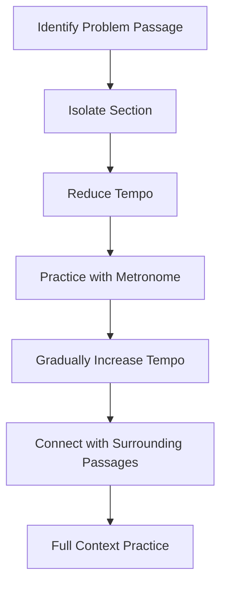

# Musical Learning Process

Growing up as a self-proclaimed "band nerd," I spent countless hours in practice rooms, rehearsals, and performances. What I didn't realize then was that those experiences were teaching me not just about music, but about the fundamental process of learning itself. The skills I developed while wrestling with difficult trumpet passages have proven invaluable throughout my professional career, especially when tackling complex programming challenges.

## The Deliberate Practice Mindset

### Breaking Down Complexity

One of the first lessons you learn in music is that you can't master a challenging piece all at once. The process looks something like this:

1. **Analyze the whole**: Understand the structure and challenging sections
2. **Isolate difficult passages**: Focus on the specific measures causing trouble
3. **Slow down dramatically**: Play at a tempo where you can achieve perfection
4. **Increment gradually**: Increase speed only when accuracy is consistent
5. **Reintegrate**: Connect the passage back into the larger context



This exact approach has served me well when learning new programming languages or debugging complex systems:

```javascript
// Learning React Hooks step by step
// 1. Analyze the concept
// 2. Isolate a single hook (useState)
// 3. Start with a simple implementation
function Counter() {
  // The isolated, simplified concept
  const [count, setCount] = useState(0);
  
  return (
    <div>
      <p>You clicked {count} times</p>
      <button onClick={() => setCount(count + 1)}>
        Click me
      </button>
    </div>
  );
}
```

Whether it's mastering a Mozart concerto or understanding a complex algorithm, the approach remains remarkably similar.

## The Feedback Loop

Music provides one of the tightest feedback loops possible:

1. **Immediate auditory feedback**: You hear your mistakes instantly
2. **Visual feedback**: You can see if your fingers hit the wrong keys
3. **Physical feedback**: You feel when your technique is incorrect
4. **External feedback**: Teachers and peers provide objective assessment

This multi-channel feedback creates a powerful learning environment. In programming, I've learned to create similar feedback systems:

| Music Feedback | Programming Equivalent |
|----------------|------------------------|
| Sound of wrong notes | Failed tests |
| Teacher critiques | Code reviews |
| Recording performances | Logging and monitoring |
| Playing with ensemble | Deployment to staging |

The most effective learners in any field create tight feedback loops that provide immediate, accurate information about their performance.

## Emotional Resilience Through Performance

Few experiences match the nerve-wracking intensity of a solo performance. As a young musician, I learned to:

1. **Manage performance anxiety**: Breathing techniques and mental preparation
2. **Recover from mistakes**: Continue playing despite errors
3. **Prepare for high-stakes moments**: Practice under pressure conditions
4. **Accept constructive criticism**: Separate personal worth from performance

These skills translate directly to professional challenges like:
- Leading important client presentations
- Debugging production issues under pressure
- Receiving critical feedback on your code
- Performing in technical interviews

> "Music allows you to fail publicly, recover gracefully, and try again - a skill that's invaluable in any professional context."

## The Discipline of Consistent Practice

Perhaps the most valuable lesson from music is the power of consistent, deliberate practice:

### The Practice Schedule Mindset

As a serious music student, I maintained a rigorous practice schedule:

- **Daily fundamentals**: Scales, arpeggios, and technical exercises
- **Deliberate challenge**: Working just beyond my current ability level
- **Spaced repetition**: Returning to difficult passages with strategic timing
- **Progress tracking**: Keeping a practice journal with goals and achievements

This approach has shaped how I approach learning any new skill:

```markdown
## Weekly Learning Schedule (Example)

### Daily (30 min)
- [ ] TypeScript fundamentals practice
- [ ] Data structure problem-solving

### Monday & Thursday (1 hour)
- [ ] Deep dive: Advanced React patterns

### Wednesday (1 hour)
- [ ] System design exercises

### Saturday (2 hours)
- [ ] Project application of new skills
- [ ] Review week's progress and adjust next week's focus
```

## The Ensemble Mentality

Playing in bands, orchestras, and chamber groups teaches crucial lessons about collaboration:

1. **Balance individual excellence with group harmony**
   - In code: Write brilliant solutions that still follow team standards

2. **Understand your role in the broader context**
   - In code: See how your module affects the overall system

3. **Listen as much as you play**
   - In code: Read and understand others' code before contributing

4. **Timing and coordination matter**
   - In code: Coordinate deployments and integrate smoothly with dependencies

5. **Different sections have different perspectives**
   - In code: UI, backend, and DevOps teams see problems differently

## The Teacher's Mindset

Many musicians eventually teach, which develops another powerful learning skill: explaining concepts to others. Teaching reveals:

- **Gaps in your own understanding**: If you can't explain it clearly, you don't fully understand it
- **Multiple learning approaches**: Different students require different explanations
- **The value of fundamentals**: Advanced skills are built on basics mastered to perfection
- **Patience with the learning process**: Progress is rarely linear

This teacher's mindset has improved my ability to:
- Write clear documentation
- Mentor junior developers
- Communicate technical concepts to non-technical stakeholders
- Deepen my own understanding through explanation

## Learning Transfer Between Domains

One of the most fascinating aspects of music education is how readily the skills transfer to seemingly unrelated domains:

| Musical Skill | Transfers To | Application |
|---------------|-------------|-------------|
| Sight reading | Pattern recognition | Spotting bugs or code smells quickly |
| Ear training | Listening skills | Better understanding client needs |
| Improvisation | Adaptability | Handling changing requirements |
| Technique drills | Typing practice | Editor shortcuts and efficiency |
| Score analysis | Systems thinking | Understanding complex codebases |

## Building Your Learning System

Based on my experience bridging music and programming, here are key principles for effective learning in any domain:

1. **Establish fundamentals first**
   ```
   Don't try to learn React before JavaScript, just as you wouldn't 
   attempt a concerto before mastering scales.
   ```

2. **Create immediate feedback loops**
   ```
   Test-driven development is like practicing with a tuner - 
   it provides instant feedback on correctness.
   ```

3. **Balance theory with practice**
   ```
   Understanding how closures work is important, but writing 
   100 of them is how you internalize the concept.
   ```

4. **Find your ensemble**
   ```
   Surround yourself with people who push you to improve and 
   provide honest feedback.
   ```

5. **Perform regularly**
   ```
   Ship code, contribute to open source, or give tech talks to 
   test your knowledge under pressure.
   ```

6. **Teach what you learn**
   ```
   Write blog posts or mentor others to solidify your understanding.
   ```

7. **Practice deliberately, not passively**
   ```
   One hour of focused practice trumps eight hours of mindless repetition.
   ```

## Conclusion

The years I spent as a band nerd weren't just about making music—they were about building a robust framework for learning that has served me in every professional endeavor since. The discipline, feedback systems, deliberate practice, and performance mindset have been invaluable as I've navigated the complex world of software development.

Whether you're learning to code, picking up a new language, or mastering any complex skill, consider adopting the mindset of a musician. Break down complexity, create tight feedback loops, practice deliberately, collaborate effectively, and perform regularly. These principles work across domains because they align with how our brains actually learn and grow.

The band room might have seemed like an unlikely place to develop professional skills, but in retrospect, I can't imagine a better training ground for a lifetime of learning.

---

*Were you involved in music or other arts growing up? How has that experience shaped your approach to learning new skills? Share your thoughts in the comments below!*