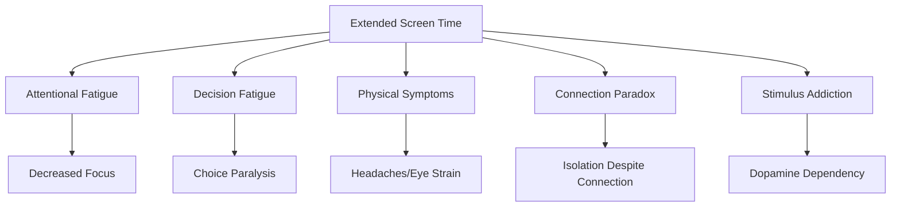

# Touching of Grass

As someone who spends 40+ hours each week staring at a screen for work, then often continues staring at different screens during leisure time, I've become acutely aware of the need to intentionally disconnect. The internet phrase "touch grass" has evolved from a dismissive insult to a genuine wellness prescription for our increasingly digital lives. This post explores the best "grass-touching" activities I've discovered—literal and metaphorical ways to reconnect with the physical world when digital fatigue sets in.

## Understanding Digital Fatigue

Before diving into solutions, it's worth understanding the problem. Digital fatigue manifests in several distinct ways:

- **Attentional fatigue**: Decreased ability to focus after extended screen time
- **Decision fatigue**: Exhaustion from constant small digital choices
- **Connection paradox**: Feeling isolated despite constant online "connection"
- **Physical symptoms**: Eye strain, headaches, disrupted sleep patterns
- **Stimulus addiction**: Craving constant novel information input



When I recognize these symptoms in myself, I know it's time for a deliberate digital detox—time to "touch grass" in both literal and figurative ways.

## Literal Grass-Touching: Outdoor Activities

### 1. Barefoot Walking in Natural Settings

There's scientific support for the benefits of direct physical contact with natural ground, often called "grounding" or "earthing":

- **Direct sensory input**: Activates thousands of nerve endings in feet
- **Proprioceptive feedback**: Improves body awareness and coordination
- **Microbial exposure**: Beneficial for immune system development
- **Electrical grounding**: Some evidence suggests neutralizing of free radicals

> "The simple act of removing shoes and socks to walk on grass, sand, or soil for 30 minutes provides a sensory reset that's difficult to replicate through any digital experience."

I've made barefoot grass walking a morning ritual when weather permits, and the difference in my mental clarity is noticeable.

### 2. Gardening: The Ultimate Grass-Touching

Gardening combines multiple beneficial elements:

- **Physical engagement**: Uses different muscle groups from office work
- **Sensory diversity**: Engages smell, touch, sight outside digital spectrum
- **Visible progress**: Creates tangible results over time
- **Patience development**: Counteracts digital instant gratification

| Gardening Activity | Physical Benefit | Mental Benefit |
|-------------------|------------------|----------------|
| Digging/planting | Upper body strength | Focus on present moment |
| Weeding | Fine motor skills | Mindfulness practice |
| Watering | Movement throughout garden | Routine establishment |
| Harvesting | Nutritional benefits | Satisfaction of completion |

For apartment dwellers, even small container gardening on a balcony provides many of these benefits.

### 3. Hiking and Nature Exploration

Hiking combines physical activity with natural exposure:

- **Variable terrain**: Challenges different muscle groups
- **Environmental attention**: Requires presence and awareness
- **Reduced digital accessibility**: Forces disconnection in remote areas
- **Awe experiences**: Exposure to natural beauty creates perspective

Research from Stanford University found that walking in natural settings reduced rumination and negative thought patterns compared to urban walking.

## Social Grass-Touching: Human Connection

### 1. Analog Game Nights

Board games and card games offer social connection without screens:

- **Face-to-face interaction**: Reading expressions and body language
- **Shared physical objects**: Creates common tactile experience
- **Multi-sensory engagement**: Physical components add dimension
- **Structured socialization**: Provides framework for interaction

```
My Essential Analog Game Collection:
- Cooperative games: Pandemic, Forbidden Island
- Strategic games: Settlers of Catan, Ticket to Ride
- Party games: Codenames, Wavelength
- Card games: The Crew, Sushi Go
```

These gatherings have become a monthly tradition in my friend group, with phones deliberately placed in a basket by the door.

### 2. Community Classes and Workshops

Learning physical skills in a group setting offers multiple benefits:

- **Shared learning experience**: Creates natural conversation
- **Skill development**: Builds confidence outside digital domain
- **Regular scheduling**: Creates structure for offline activities
- **Community building**: Connects you with like-minded people

Some particularly beneficial workshop types:

| Workshop Type | Physical Component | Social Component | Mental Component |
|---------------|-------------------|------------------|------------------|
| Cooking classes | Taste, smell, touch | Collaborative preparation | Following complex instructions |
| Pottery/ceramics | Hand-eye coordination | Shared creative space | Artistic expression |
| Dance lessons | Full-body movement | Partner interaction | Learning sequences |
| Woodworking | Tool manipulation | Sharing techniques | Spatial reasoning |

I've found ceramics classes particularly effective as a digital detox—it's impossible to check your phone when your hands are covered in clay.

### 3. Volunteering in Physical Settings

Service-oriented activities provide meaning while disconnecting:

- **Trail maintenance**: Physical work in natural settings
- **Community gardens**: Combining nature with social purpose
- **Animal shelters**: Emotional connection with animals
- **Habitat for Humanity**: Tangible construction results

These activities not only pull you away from screens but create a sense of purpose and contribution that digital activities rarely provide.

## Mindful Grass-Touching: Awareness Practices

### 1. Sensory-Focused Meditation

Meditation that specifically focuses on physical sensations helps reconnect with the body:

```markdown
## 5-Minute Sensory Reset Meditation

1. Find a comfortable seated position outdoors
2. Close your eyes and take 3 deep breaths
3. Focus on HEARING - notice 5 different sounds
4. Focus on FEELING - notice 5 different physical sensations
5. Focus on SMELLING - notice any scents in the air
6. Focus on SEEING - open eyes and notice 5 details you hadn't before
7. Take 3 more deep breaths
```

This practice takes just minutes but effectively resets attention to the physical world.

### 2. Analog Journaling and Sketching

The physical act of writing or drawing engages different neural pathways:

- **Handwriting**: Requires fine motor control and coordination
- **Unfiltered expression**: No backspace or delete key
- **Sensory feedback**: Pen pressure, paper texture, ink flow
- **Single-tasking**: Difficult to multitask while writing/drawing

I keep a pocket-sized notebook specifically for times when I need a digital break but still want to capture thoughts or observations.

### 3. Contemplative Walking

Walking with specific attention practices enhances reconnection:

- **Attention to gait**: Noticing how feet contact the ground
- **Breath coordination**: Syncing breath with steps
- **Horizon gazing**: Looking up and out rather than down
- **Sound awareness**: Noticing natural and human sounds

These practices transform a simple walk into a powerful mindfulness exercise.

## Creative Grass-Touching: Making Physical Things

### 1. Cooking and Baking From Scratch

Food preparation involves nearly all senses:

- **Tactile engagement**: Kneading dough, chopping vegetables
- **Olfactory stimulation**: Aromas during cooking process
- **Taste development**: Adjusting flavors through tasting
- **Visual creativity**: Plating and presentation
- **Auditory cues**: Sizzling, boiling, timer bells

The physical process of creating meals engages parts of ourselves that remain dormant during digital activities.

### 2. Traditional Crafts and Handwork

Working with physical materials provides unique satisfaction:

- **Knitting/crochet**: Rhythmic, meditative hand movements
- **Woodworking**: Resistance and response of natural materials
- **Painting/drawing**: Hand-eye coordination and expression
- **Leatherwork**: Tactile engagement with durable material

These activities produce tangible results that exist in physical space rather than as pixels on a screen.

### 3. Instrument Practice

Learning a musical instrument combines multiple beneficial elements:

- **Physical coordination**: Fine and gross motor skills
- **Auditory feedback**: Immediate response to actions
- **Progress tracking**: Clear skill development over time
- **Flow state induction**: Complete absorption in activity

Even 15-30 minutes of instrument practice provides a refreshing break from digital immersion.

## Extreme Grass-Touching: Extended Digital Detox

For those experiencing severe digital fatigue, more extreme measures may be beneficial:

### 1. Weekend Tech Sabbaticals

Designating weekly screen-free periods:

```markdown
# My Digital Sabbath Practice

## Preparation (Friday evening)
- Set email autoresponder
- Notify close contacts
- Place devices in designated drawer
- Prepare physical activities and reading materials

## During (Saturday sunset to Sunday sunset)
- No smartphones, computers, tablets
- No streaming services or digital entertainment
- Exception only for emergency phone calls

## Re-entry (Sunday evening)
- Brief check of important messages only
- Reflection journaling on the experience
- Planning for the week ahead
```

This practice, inspired by traditional Sabbath observance, creates a rhythmic pattern of connection and disconnection.

### 2. Silent Retreats

Structured multi-day experiences without devices:

- **Meditation centers**: Guided silent practice
- **Monasteries**: Religious or secular stays
- **Nature retreats**: Wilderness immersion programs
- **Self-guided retreats**: Personal cabins or remote rentals

These experiences often create profound perspective shifts about technology's role in our lives.

### 3. Skill Immersion Weeks

Dedicating vacation time to intensive physical skill development:

- **Outdoor survival courses**
- **Language immersion programs**
- **Craft intensives or workshops**
- **Farm stays or WWOOF programs**

These experiences combine digital detox with significant skill acquisition.

## Creating a Sustainable Grass-Touching Practice

The key to effective digital detachment is sustainability. One-time detox experiences provide temporary relief, but incorporating regular physical reconnection into daily life creates lasting balance.

### My Digital/Physical Balance System

Through experimentation, I've developed a tiered system that works for my life:

| Frequency | Activity Type | Duration | Example Activities |
|-----------|--------------|----------|-------------------|
| Daily | Micro-detox | 15-30 min | Morning barefoot walk, journaling, stretching |
| Weekly | Mini-detox | 2-4 hours | Game night, hiking, cooking elaborate meal |
| Monthly | Midi-detox | Full day | Daylong workshop, nature immersion, volunteer day |
| Quarterly | Maxi-detox | 2-3 days | Silent retreat, camping trip, craft intensive |

This tiered approach ensures regular physical reconnection without creating unsustainable commitments.

## Measuring Success Beyond "Time Spent"

Rather than simply tracking time away from screens, I've found it more meaningful to assess quality of physical engagement through journaling prompts:

- **Sensory diversity**: "What senses did I engage today beyond sight?"
- **Physical creation**: "What did I make with my hands this week?"
- **Nature connection**: "When did I last feel weather on my skin?"
- **Social presence**: "Have I had eye contact during conversation today?"
- **Flow experiences**: "When did I last lose track of time while doing something physical?"

These qualitative measures provide a richer understanding of physical engagement than simple screen time metrics.

## Conclusion: Beyond the Meme

The "touch grass" meme contains surprising wisdom for our digital age. The physical world offers sensory richness, presence, and forms of satisfaction that digital experiences—no matter how advanced—simply cannot replicate.

The activities I've described aren't about rejecting technology. Rather, they're about creating a balanced life where technology serves as one of many tools for experience and connection, not the primary or sole medium through which we engage with reality.

In my own journey, I've found that the more intentionally I "touch grass"—literally and figuratively connecting with the physical world—the more I enjoy the digital experiences I do engage with. Balance creates appreciation for both domains.

What grass will you touch today?

---

*What are your favorite ways to disconnect from digital life and reconnect with the physical world? Share your "grass-touching" practices in the comments below.*