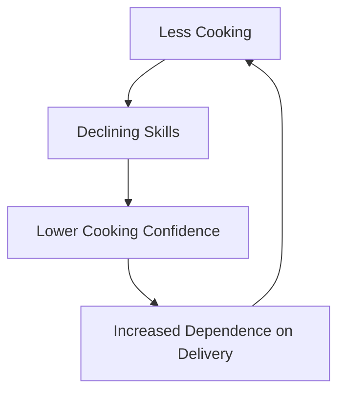

# DoorDash Addiction

I'll admit it upfront: I've been a DoorDash addict. For nearly three years, I ordered food delivery 4-5 times weekly, watching my savings dwindle while my waistline expanded. What started as an occasional convenience during busy workweeks gradually morphed into a default behavior that was draining my finances and affecting my health. And I'm far from alone in this modern dependency.

## The Rise of Food Delivery Addiction

Food delivery isn't new, but the frictionless experience created by apps like DoorDash, Uber Eats, and Grubhub has fundamentally changed our relationship with prepared food. What was once a rare treat has become an everyday habit for millions.

### The Numbers Tell a Troubling Story

Recent statistics paint a concerning picture of delivery dependency:

- The average American now spends **$2,029 annually** on food delivery apps
- **26%** of Americans order delivery at least twice weekly
- Food delivery app usage increased **67%** from 2019 to 2023
- **38%** of frequent delivery users report feeling "dependent" on the service
- The average delivery order costs **72% more** than preparing the same meal at home

```
My Personal DoorDash Math:
- Average order: $25 (meal) + $7 (fees, tip) = $32
- Weekly total: $32 × 4 orders = $128
- Monthly total: $128 × 4 weeks = $512
- Annual total: $512 × 12 months = $6,144
```

That's more than many people spend on car payments for a year—all for the convenience of not cooking or driving to pick up food.

## The Psychology Behind the Addiction

What makes food delivery so addictive? The apps leverage several psychological principles that create a perfect storm for habit formation:

### 1. Variable Reward Mechanisms

Food delivery apps use the same variable reward mechanisms that make gambling and social media addictive:

- **Promotional discounts** that appear randomly
- **Limited-time offers** creating urgency
- **Discovery of new restaurants** offering novelty
- **Tracking your order** providing anticipation

This unpredictable reward structure triggers dopamine release, reinforcing the behavior pattern.

### 2. Removal of Friction Points

Traditional barriers to frequent restaurant dining have been systematically eliminated:

| Traditional Friction | App Solution | Psychological Impact |
|----------------------|--------------|---------------------|
| Driving to restaurant | Delivery to door | Reduces effort threshold |
| Talking to people | App interface | Eliminates social anxiety |
| Carrying cash/card | Stored payment | Reduces payment pain |
| Menu decision paralysis | Favorites and recommendations | Simplifies choices |
| Weather constraints | Delivery in any condition | Removes external barriers |

By removing these friction points, the apps have made ordering food delivery easier than cooking in many cases.

### 3. Normalization Through Social Proof

The epidemic has been normalized through social channels:

- **Social media "unboxing"** of delivery meals
- **Work cultures** that normalize delivery lunches
- **Chat app lunch coordination** among colleagues
- **Influencer partnerships** with delivery platforms

> "It's not just that delivery is convenient—it's that our entire social environment now reinforces it as normal behavior."

## The Hidden Costs Beyond Money

While the financial impact is obvious, the delivery addiction carries other significant costs:

### 1. Health Consequences

The health impacts of regular delivery usage are concerning:

- Restaurant meals contain an average of **60% more calories** than home-cooked equivalents
- Delivery users report **33% less fruit and vegetable consumption**
- Regular delivery users are **27% more likely** to be classified as overweight
- The average sodium content in delivered meals is **112% higher** than home-cooked alternatives

During my peak delivery dependency, I gained 15 pounds in six months without changing anything else in my routine.

### 2. Cooking Skill Atrophy



This vicious cycle leads to a generation increasingly unable to prepare basic meals. A recent survey found that 28% of Millennials can't cook five meals without a recipe, compared to 11% of Baby Boomers.

### 3. Environmental Impact

The environmental cost of delivery addiction adds up:

- **Single-use packaging** waste from containers and bags
- **Extra vehicle trips** compared to efficient grocery shopping
- **Idle delivery vehicles** waiting for orders
- **Food waste** from oversized restaurant portions

One study estimated that frequent delivery users generate an additional 425 pounds of waste annually compared to those who primarily cook at home.

## The Technology That Enables Addiction

Food delivery apps employ sophisticated techniques to drive engagement and dependency:

### 1. Personalized Manipulation

The apps use your data to drive continued usage:

- **Time-based prompts**: Notifications around your typical meal times
- **Weather-based suggestions**: Promoting delivery during rain or extreme temperatures
- **Past order analysis**: Suggesting reorders when you typically order
- **Location-based triggers**: Notifications when you're home during meal hours

### 2. Gamification Elements

Many delivery apps incorporate gaming elements to drive engagement:

- **Reward points** for continued usage
- **Status levels** for frequent users
- **Streaks and challenges** to maintain usage patterns
- **Limited-time achievements** for trying new restaurants

```
DashPass Subscription Psychology:
- Upfront cost creates commitment
- "Free delivery" feels like savings
- Sunk cost fallacy encourages more orders
- Regular reminders of membership value
```

### 3. Artificial Urgency

The apps create a sense of scarcity and urgency:

- **Limited-time promotions** that expire
- **Restaurant closing soon** warnings
- **Popular items selling out** notifications
- **Surge pricing** during peak times

## My Delivery Detox Journey

Recognizing my dependence on food delivery, I embarked on a deliberate "detox" process that revealed how deeply ingrained the habit had become:

### Week 1: Withdrawal Symptoms

The first week without delivery was genuinely challenging:

- **Decision fatigue** around meal planning
- **Time management stress** fitting cooking into my schedule
- **Actual cravings** for specific restaurant meals
- **Justification attempts** ("I'm too busy tonight")

### Week 2: Kitchen Reorientation

As I pushed through the initial discomfort:

- **Rediscovered basic cooking skills** I had neglected
- **Reorganized my kitchen** for efficient meal preparation
- **Developed a simple meal template** system
- **Experienced satisfaction** from creating meals

### Week 3: New Habits Forming

By the third week:

- **Grocery shopping became routine** again
- **Meal prep became enjoyable** rather than burdensome
- **Food expenses dropped dramatically**
- **Energy levels improved** with better nutrition

### Financial Impact

The most immediate benefit was financial:

| Category | Before Detox (Monthly) | After Detox (Monthly) | Annual Savings |
|----------|------------------------|----------------------|----------------|
| Food Delivery | $465 | $60 | $4,860 |
| Groceries | $240 | $380 | -$1,680 |
| **Net Difference** | | | **$3,180** |

The savings funded a vacation that would have been impossible during my delivery addiction phase.

## Breaking the Cycle: Practical Strategies

Based on my experience and research, here are effective strategies for breaking delivery dependence:

### 1. Environment Modification

- **Delete the apps** from your phone (most critical step)
- **Block emails** from delivery services
- **Stock your kitchen** with easy meal components
- **Position cooking tools** visibly in your kitchen

### 2. Skill Development

- **Master 5-10 simple recipes** that take 30 minutes or less
- **Learn batch cooking** for efficient meal preparation
- **Practice one-pot meals** that minimize cleanup
- **Start with "assembly" meals** that don't require cooking

### 3. Social Reinforcement

- **Cook with friends** to make it a social activity
- **Meal prep exchanges** with neighbors or colleagues
- **Share cooking successes** on social media for accountability
- **Join cooking communities** online for inspiration

### 4. Mindful Moderation

Rather than complete elimination, establish boundaries:

```markdown
## My Sustainable Delivery Rules

1. Max once per week (Saturday treat)
2. No delivery when groceries are available
3. No impulsive ordering - decide in the morning
4. $50 monthly delivery budget - when it's gone, it's gone
5. Delete payment information - manual entry required
```

## The Broader Societal Implications

The food delivery epidemic reveals broader trends in our relationship with convenience and technology:

1. **The outsourcing of basic life skills** to service providers
2. **The hidden costs of convenience** in health and financial well-being
3. **The subtle shift from tools to dependencies** in our technological relationships
4. **The growing disconnection from food sources and preparation**

These patterns extend beyond food delivery to rideshare, grocery delivery, laundry services, and other convenience technologies that are reshaping how we live—often without our conscious evaluation of the tradeoffs.

## Finding Balance in a Convenience Economy

The solution isn't rejecting technology or convenience entirely, but rather developing a healthier relationship with these services:

1. **Use convenience as a tool, not a lifestyle**
2. **Maintain essential life skills** despite automation options
3. **Regularly audit convenience spending** for value alignment
4. **Create intentional friction** for potentially addictive services

## Conclusion

My experience with DoorDash addiction opened my eyes to how easily convenience can transform into dependency. What began as an occasional time-saver became a financial drain, a health liability, and a genuine addiction.

The food delivery epidemic reflects our broader relationship with technology—how services designed to make our lives easier can paradoxically complicate them by fostering dependencies and eliminating valuable skills and experiences.

By acknowledging these patterns and establishing healthier boundaries with convenience services, we can enjoy their benefits without surrendering our financial health, physical wellbeing, or personal capabilities.

The next time your finger hovers over that "Place Order" button, ask yourself: Is this a conscious choice or a symptom of dependency?

---

*Have you experienced delivery app dependence? What strategies have helped you maintain a healthier relationship with convenience services? Share your experiences in the comments below.*