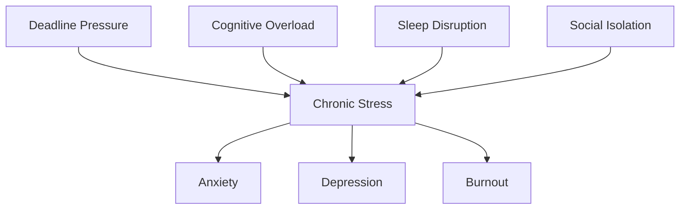

# Erosion of Programming Lifestyles

When I decided to become a programmer, the career counselor never mentioned that I was also signing up for a collection of occupational health risks that would follow me throughout my career. Our industry celebrates long hours and intense focus but rarely discusses the physical and mental health impacts that accompany the programming lifestyle. Having spent over a decade in this field, I've experienced many of these effects firsthand and witnessed colleagues struggle with the same issues.

## The Sedentary Reality

The foundation of programming's health impact is its fundamentally sedentary nature. The data paints a concerning picture:

- Programmers sit an average of **8-12 hours daily**
- Prolonged sitting is linked to a **125% increased risk of cardiovascular disease**
- Each 2-hour increase in sitting time is associated with a **7% increase in diabetes risk**

> "Sitting is the new smoking" - Dr. James Levine, Mayo Clinic

The human body simply wasn't designed for this level of inactivity. Yet the nature of programming work—requiring deep focus and flow states—makes it all too easy to remain stationary for dangerous lengths of time.

## The Physical Toll

### 1. Musculoskeletal Disorders

The most immediate physical impact comes in the form of musculoskeletal issues:

| Condition | Prevalence Among Programmers | Primary Cause |
|-----------|------------------------------|---------------|
| Carpal Tunnel Syndrome | 21% | Repetitive keyboard/mouse movements |
| Neck Pain | 67% | Poor monitor positioning and forward head posture |
| Lower Back Pain | 58% | Poor sitting posture and weak core muscles |
| Tennis Elbow | 15% | Repetitive mouse movements |

My own journey with these issues began with occasional wrist pain that I ignored, which eventually developed into severe tendonitis requiring physical therapy and weeks away from coding.

### 2. Vision Problems

Computer Vision Syndrome (CVS) affects an estimated 75% of programmers who work more than 6 hours daily at screens:

- **Symptoms**: Eye strain, blurred vision, dry eyes, headaches
- **Causes**: Blue light exposure, reduced blink rate, improper screen distance
- **Long-term risks**: Potential acceleration of myopia and early presbyopia

```markdown
# My Vision Protection Protocol

1. 20-20-20 Rule
   - Every 20 minutes
   - Look at something 20 feet away
   - For at least 20 seconds

2. Screen Setup
   - Monitor at arm's length
   - Top of screen at eye level
   - Anti-glare filter installed

3. Environment
   - Diffuse lighting (no direct glare)
   - Moderate brightness matched to room
   - Regular screen breaks
```

### 3. Metabolic Issues

The sedentary programming lifestyle contributes to serious metabolic changes:

- **Weight gain**: Reduced caloric expenditure while maintaining or increasing caloric intake
- **Insulin resistance**: Prolonged sitting reduces muscle activity that normally helps process blood glucose
- **Lipid disorders**: Changes in how the body processes fats in the bloodstream

These metabolic changes aren't immediately visible but create cumulative health risks that become apparent over years of programming work.

## The Cognitive and Mental Health Impact

### 1. Sleep Disruption

Perhaps no single health factor impacts programmers more universally than disrupted sleep:

- **Blue light exposure**: Suppresses melatonin production and circadian rhythm
- **Mental activation**: Problem-solving before bed keeps the mind active
- **Irregular hours**: Late-night coding sessions and irregular schedules

A poll of programmers on Stack Overflow found that 68% report having trouble falling asleep after evening coding sessions. This creates a dangerous cycle—poor sleep reduces cognitive function, which then requires longer hours to accomplish the same work.

### 2. Stress and Mental Health

Programming combines multiple psychological stressors:

- **Deadline pressure**: Often working against tight, sometimes unrealistic timelines
- **Cognitive load**: Maintaining complex mental models for extended periods
- **Impostor syndrome**: Persistent feelings of inadequacy despite objective success
- **Social isolation**: Reduced face-to-face interaction during deep work periods

These factors contribute to concerning mental health statistics within our field:

- Programmers report **58% higher rates of anxiety** than the general workforce
- Depression prevalence is approximately **40% higher** in tech workers



## The Social Dimension

The programming lifestyle also affects our social connections:

- **Long hours reduce family time**: 62% of programmers report work regularly cutting into family activities
- **Remote work isolation**: While offering flexibility, can reduce meaningful human interaction
- **Communication challenges**: Technical minds sometimes struggle with work-life separation

One particularly troubling pattern I've observed is the glorification of social sacrifice for technical progress. Our industry often celebrates those who forsake relationships and personal time for coding achievements.

## Food and Nutrition Challenges

The programming work environment creates several nutrition challenges:

### 1. The Desk Lunch Phenomenon

- **Mindless eating**: Consuming food while focusing on code reduces satiety signals
- **Poor food choices**: Convenience foods dominate workplace environments
- **Shortened lunch breaks**: Taking a proper meal break is often discouraged by work culture

### 2. The Caffeine Cycle

- **Average programmer consumes 3.2 caffeinated beverages daily**
- **Afternoon energy crashes lead to more caffeine or sugar**
- **Late caffeine consumption contributes to sleep problems**

### 3. Delivery Culture

The rise of food delivery services has enabled programmers to remain at their desks even longer:

- DoorDash reports tech companies order 51% more frequently than other industries
- Programmers are 72% more likely to order dinner to the office than other professionals
- Habitual delivery ordering is associated with higher caloric intake and lower nutritional quality

## Breaking the Cycle

After experiencing many of these issues personally, I've developed a system to counteract programming's health effects. While not perfect, these strategies have significantly improved my well-being:

### 1. Movement Integration

```
# Movement Triggers

- New git commit → 10 squats
- Build running → 25 jumping jacks
- Code review received → Quick walk
- Merge completed → 5-minute stretch routine
- Every 2 hours → 10-minute walk
```

By tying movement to regular programming events, I've increased my daily activity without feeling like I'm "taking time away" from coding.

### 2. Workspace Optimization

The right setup makes a tremendous difference:

- **Sit-stand desk**: Alternating between positions throughout the day
- **Ergonomic chair**: Properly supporting spine alignment
- **Monitor arm**: Allowing perfect positioning for neck alignment
- **Split keyboard**: Reducing wrist pronation
- **Proper lighting**: Reducing eye strain

### 3. Digital Boundaries

Setting clear boundaries has been crucial for mental health:

- **No code after 8pm**: Allows brain to wind down before sleep
- **No Slack/email before breakfast**: Preserves morning mental clarity
- **Dedicated non-screen activities**: Reading physical books, outdoor hobbies
- **Tech-free spaces**: Bedroom remains a screen-free zone

### 4. Preventative Health Practices

Rather than waiting for problems, I've adopted preventative measures:

- **Regular physical therapy**: Addressing small issues before they become debilitating
- **Vision checks**: Annually updating prescriptions and checking for screen-related changes
- **Standing/walking meetings**: Converting passive meeting time into active time
- **Regular strength training**: Focusing on posture-supporting muscle groups

## The Industry's Responsibility

While individual programmers must take action to protect their health, our industry also bears responsibility:

1. **Company policies should acknowledge health risks** inherent to programming work
2. **Work environments should support movement** throughout the day
3. **Team cultures should discourage unhealthy practices** like skipping meals or excessive hours
4. **Health resources should be accessible** and encouraged

Some forward-thinking companies have begun implementing:
- Wellness time built into project timelines
- Ergonomics budgets for remote workers
- Mental health days separate from sick leave
- Activity-based team events instead of sedentary happy hours

## Conclusion

Programming offers intellectual rewards and career opportunities few other fields can match. However, the lifestyle it encourages carries significant health risks that often go undiscussed in our education and training.

By acknowledging these risks and proactively addressing them, we can enjoy sustainable careers without sacrificing our physical and mental well-being. The solution isn't to abandon programming—it's to program differently, with our health as a non-negotiable priority.

The next generation of programmers shouldn't have to choose between their passion for code and their personal health. By speaking openly about these challenges and sharing solutions, we can create a healthier future for everyone in our field.

---

*What health effects have you experienced from programming work? What strategies have you found effective for maintaining well-being? Share your experiences in the comments below.*