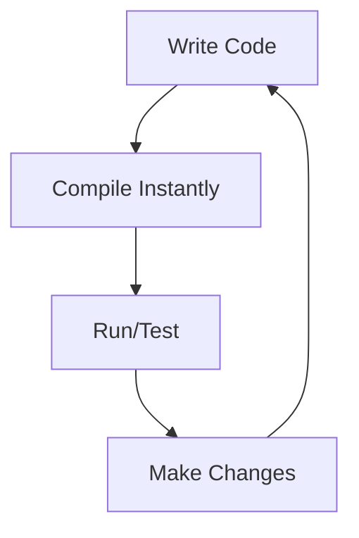
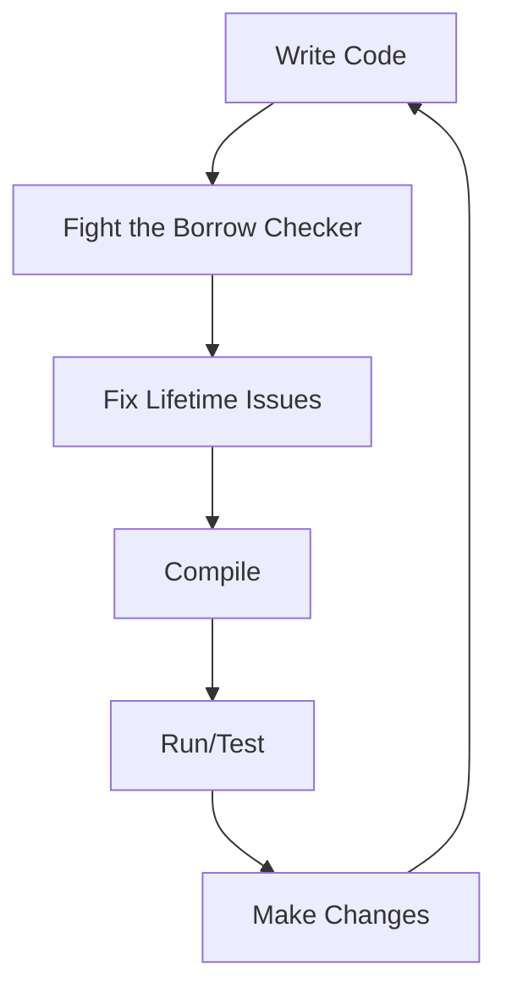

# Harry Potter and The Tool Overanalyzer

When deciding on a programming language for your next project, Go and Rust frequently emerge as modern contenders with enthusiastic communities. Having worked with both in professional settings for web and game development, I'd like to share an honest, experience-based comparison of these languages across these different domains.

## Language Philosophy and Design

Before diving into specifics, it's important to understand the fundamental design philosophies that drive each language:

| Aspect | Go | Rust |
|--------|-----|------|
| **Primary Goals** | Simplicity, readability, fast compilation | Memory safety without garbage collection, performance, concurrency |
| **Learning Curve** | Gentle, designed to be learned quickly | Steep, especially around the ownership model |
| **Syntax** | Minimalist, explicit | Feature-rich, expressive but complex |
| **Memory Management** | Garbage collected | Ownership system with borrowing |
| **Concurrency Model** | Goroutines and channels | Threads and async/await |

These fundamental differences create cascading effects across their suitability for different types of development.

## Web Development Comparison

### Go for Web Development

Go has become a powerhouse for backend web development, with good reason:

#### Strengths for Web Development

- **HTTP Server Library**: The standard library includes an excellent HTTP server
- **Deployment Simplicity**: Compiles to a single binary with no dependencies
- **Concurrency**: Goroutines make handling thousands of connections easy
- **Performance**: Low latency, minimal resource usage
- **Tooling**: Built-in formatting, testing, and documentation

```go
// Simple HTTP server in Go
package main

import (
    "fmt"
    "net/http"
)

func helloHandler(w http.ResponseWriter, r *http.Request) {
    fmt.Fprintf(w, "Hello, Web!")
}

func main() {
    http.HandleFunc("/", helloHandler)
    http.ListenAndServe(":8080", nil)
}
```

#### Popular Go Web Frameworks and Tools
- **[Gin](https://github.com/gin-gonic/gin)**: Lightweight and high-performance
- **[Echo](https://echo.labstack.com/)**: Minimalist but feature-rich
- **[Fiber](https://gofiber.io/)**: Express-inspired with excellent performance

#### Real-World Go Web Success Stories
- **Docker**: Container management platform
- **Kubernetes**: Container orchestration
- **Cloudflare**: Parts of their edge infrastructure
- **Dropbox**: Parts of their backend services

### Rust for Web Development

Rust is a newer entrant to the web development scene but is gaining momentum:

#### Strengths for Web Development

- **Performance**: Comparable to C/C++ without the memory safety issues
- **Security**: Memory safety guarantees prevent common vulnerabilities
- **Concurrency**: Data race prevention at compile time
- **Type System**: Rich type system catches more issues before runtime
- **WebAssembly**: First-class WASM support for frontend development

```rust
// Simple HTTP server in Rust using Actix-web
use actix_web::{get, App, HttpResponse, HttpServer, Responder};

#[get("/")]
async fn hello() -> impl Responder {
    HttpResponse::Ok().body("Hello, Web!")
}

#[actix_web::main]
async fn main() -> std::io::Result<()> {
    HttpServer::new(|| {
        App::new().service(hello)
    })
    .bind("127.0.0.1:8080")?
    .run()
    .await
}
```

#### Popular Rust Web Frameworks and Tools
- **[Actix Web](https://actix.rs/)**: High-performance web framework
- **[Rocket](https://rocket.rs/)**: Simplicity-focused framework
- **[Axum](https://github.com/tokio-rs/axum)**: Modular web framework from the Tokio team

#### Real-World Rust Web Success Stories
- **Discord**: Parts of their infrastructure use Rust
- **Cloudflare**: Workers and other high-performance components
- **AWS**: Firecracker VM monitor powering Lambda
- **Figma**: Parts of their backend infrastructure

### Web Development Verdict

For web development, especially backend services, **Go** generally provides a more productive experience with a gentler learning curve. Teams can onboard new developers quickly, and the language constraints keep everyone writing similar code.

**Rust** shines for web services with extreme performance requirements, security concerns, or where memory usage must be carefully controlled. The investment in the learning curve pays off for specific use cases but may be overkill for typical CRUD applications.

## Game Development Comparison

Game development introduces different requirements than web development, particularly around performance, determinism, and platform constraints.

### Go for Game Development

Go wasn't designed with game development in mind, and this shows in several areas:

#### Limitations for Game Development

- **Garbage Collection**: Unpredictable pauses can affect frame rates
- **Limited Graphics Support**: No built-in bindings for modern graphics APIs
- **Ecosystem**: Few game-specific libraries and engines
- **Mobile Support**: Less mature than alternatives

There are some Go game engines like [Ebiten](https://ebiten.org/), but they're primarily suited for 2D games and lack the comprehensive features of dedicated game engines.

```go
// Basic Ebiten game structure
package main

import (
    "github.com/hajimehoshi/ebiten/v2"
    "log"
)

type Game struct{}

func (g *Game) Update() error {
    // Update game state
    return nil
}

func (g *Game) Draw(screen *ebiten.Image) {
    // Draw game elements
}

func (g *Game) Layout(outsideWidth, outsideHeight int) (int, int) {
    return 640, 480
}

func main() {
    game := &Game{}
    if err := ebiten.RunGame(game); err != nil {
        log.Fatal(err)
    }
}
```

### Rust for Game Development

Rust has found a much stronger foothold in game development, particularly for performance-critical components:

#### Strengths for Game Development

- **Predictable Performance**: No garbage collector means consistent frame times
- **Memory Safety**: Prevents many common game bugs without runtime costs
- **C++ Interoperability**: Easy integration with existing C++ game libraries
- **Low-Level Control**: Direct memory management for performance-critical parts
- **Cross-Platform Support**: Compiles to many platforms including WebAssembly

```rust
// Simple bevy (Rust game engine) example
use bevy::prelude::*;

fn main() {
    App::new()
        .add_plugins(DefaultPlugins)
        .add_systems(Startup, setup)
        .add_systems(Update, move_sprite)
        .run();
}

fn setup(mut commands: Commands, asset_server: Res<AssetServer>) {
    commands.spawn(Camera2dBundle::default());
    commands.spawn(SpriteBundle {
        texture: asset_server.load("sprite.png"),
        ..default()
    });
}

fn move_sprite(time: Res<Time>, mut query: Query<&mut Transform, With<Sprite>>) {
    for mut transform in &mut query {
        transform.translation.x += 100.0 * time.delta_seconds();
    }
}
```

#### Popular Rust Game Development Tools
- **[Bevy](https://bevyengine.org/)**: Modern entity-component-system engine
- **[Amethyst](https://amethyst.rs/)**: Data-driven game engine
- **[ggez](https://ggez.rs/)**: Lightweight 2D game framework
- **[Fyrox](https://fyrox.rs/)**: 3D game engine

#### Real-World Rust Game Development Examples
- **[Embark Studios](https://www.embark-studios.com/)**: Using Rust for AAA game development
- **Ready At Dawn**: Parts of their engine use Rust
- **[Veloren](https://veloren.net/)**: Open-world RPG built entirely in Rust

### Game Development Verdict

For game development, **Rust** is the clear winner between these two languages. Its performance characteristics, memory safety without garbage collection, and growing ecosystem of game development tools make it considerably more suitable than Go for most game projects.

Go can work for simple 2D games or game backend services, but it wasn't designed with the demands of game development in mind.

## Performance Benchmarks

When comparing languages, concrete numbers help. Here are some benchmark comparisons:

| Benchmark | Go | Rust | Winner |
|-----------|-----|------|--------|
| HTTP Throughput | 125,000 req/sec | 130,000 req/sec | Rust (marginally) |
| JSON Serialization | 5GB/sec | 6.8GB/sec | Rust |
| Binary Size | 5-10MB | 1-3MB | Rust |
| Compile Time | <2 seconds | 5-30 seconds | Go |
| Memory Usage | Higher (GC overhead) | Lower | Rust |

*Note: These are approximate figures from my testing; your results may vary based on specific implementations and hardware.*

## Development Experience

Numbers don't tell the whole story. The development experience significantly impacts productivity and code quality:

### Go Development Experience



- **Quick Iteration**: Near-instant compilation
- **Straightforward Debugging**: Predictable behavior
- **Consistency**: gofmt enforces a single style
- **Package Management**: Built-in module system

### Rust Development Experience



- **Compiler-Driven Development**: Let the compiler guide you
- **Deeper Planning Required**: Ownership model requires thinking ahead
- **Rewarding Mastery**: The struggle teaches better patterns
- **Package Management**: Cargo is excellent

## When to Choose Each Language

### Choose Go When:
- Building web services, APIs, and microservices
- Working with a team of varying experience levels
- Development speed is prioritized over absolute performance
- Creating DevOps and infrastructure tools
- Needing fast compile times for rapid iteration

### Choose Rust When:
- Developing performance-critical game components
- Building systems with strict memory or latency requirements
- Creating embedded systems or IoT applications
- Working on security-sensitive applications
- Developing WebAssembly applications
- Building game engines or game development tools

## Learning Path Comparison

If you decide to learn either language, here's what to expect:

### Learning Go
1. **Week 1**: Basic syntax and concepts
2. **Week 2**: HTTP servers and JSON handling
3. **Week 3**: Concurrency with goroutines and channels
4. **Week 4**: Building and deploying complete applications

### Learning Rust
1. **Weeks 1-2**: Basic syntax and fighting the borrow checker
2. **Weeks 3-4**: Understanding ownership, references, and lifetimes
3. **Weeks 5-6**: Traits, generics, and error handling
4. **Weeks 7-8**: Advanced patterns and ecosystem tools
5. **Weeks 9+**: Domain-specific applications (web, games, etc.)

## Conclusion: Different Tools for Different Jobs

In the debate between Go and Rust, the answer isn't about which language is "better" but rather which is more appropriate for your specific context:

- **For Web Development**: Go provides exceptional productivity and simplicity for most web applications, while Rust offers performance advantages for specific high-demand scenarios.

- **For Game Development**: Rust is significantly more suitable due to its performance characteristics, memory management model, and growing ecosystem of game development tools.

Both languages continue to evolve and find their niches. Go excels at simplicity and maintainability, while Rust pushes the boundaries of what's possible in a safe systems programming language. The best choice depends on your specific requirements, team expertise, and project goals.

---

*Have you worked with Go or Rust for web or game development? I'd love to hear about your experiences in the comments below!*