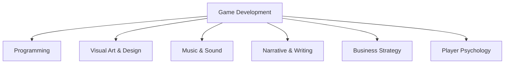

# Harry Potter and The Intersection of Creativity

Game development occupies a unique space in the creative landscape – it's perhaps the only medium that demands mastery across multiple creative disciplines. While other fields may touch on several domains, game creation stands alone in requiring proficiency in coding, music, narrative, art, and business simultaneously. This convergence of skills makes game development both incredibly challenging and uniquely rewarding.

## The Multidisciplinary Nature of Game Development

When I first started making games, I naively thought that coding would be the primary skill required. I quickly discovered that creating even a simple game demands competency across a spectrum of creative disciplines:



Let's explore each of these creative intersections and what makes them essential to game development.

## 1. Programming: The Technical Canvas

At its foundation, a game is software. The code serves as the framework that enables all other creative expressions to function together.

### The Unique Challenges of Game Programming

Game programming differs from traditional software development in several key ways:

- **Performance Constraints**: Games must maintain consistent frame rates while handling complex systems
- **State Management**: Tracking countless interacting objects and their properties
- **Physics Simulation**: Creating believable movement and collisions
- **AI Behavior**: Designing entities that respond intelligently to player actions
- **Input Handling**: Creating responsive controls across various devices

```javascript
// A simple game loop demonstrating the unique timing and state management in games
function gameLoop(timestamp) {
  // Calculate time since last frame
  const deltaTime = timestamp - lastFrameTime;
  lastFrameTime = timestamp;
  
  // Update all game entities
  for (const entity of gameEntities) {
    entity.update(deltaTime);
    
    // Check for collisions with other entities
    for (const other of gameEntities) {
      if (entity !== other && entity.collidesWith(other)) {
        handleCollision(entity, other);
      }
    }
  }
  
  // Render the current state
  clearCanvas();
  for (const entity of gameEntities) {
    entity.render(ctx);
  }
  
  // Continue the loop
  requestAnimationFrame(gameLoop);
}
```

The code above illustrates a fundamental pattern in game development: the continuous cycle of updating state and rendering the results. This technical foundation must be rock-solid for the game's creative elements to shine.

## 2. Visual Art & Design: The Aesthetic Experience

Games are inherently visual experiences. The art style not only defines the aesthetic but also communicates gameplay information to the player.

### The Spectrum of Game Art

Game art encompasses numerous specialties:

- **Character Design**: Creating memorable protagonists, NPCs, and enemies
- **Environment Art**: Building the worlds players explore
- **UI/UX Design**: Crafting intuitive interfaces for player interaction
- **Animation**: Bringing characters and environments to life
- **VFX**: Creating visual feedback for player actions and game events

The visual language of a game must balance artistic expression with functionality. Players need to instantly understand what they can interact with, where they can go, and what poses a threat – all through visual design.

> "In game art, every artistic decision is also a design decision that affects how players understand and interact with the game world."

## 3. Music & Sound: The Emotional Landscape

Sound design and music composition create the emotional foundation of the player experience. Even the simplest games benefit enormously from thoughtful audio.

### The Components of Game Audio

Game audio includes:

| Audio Element | Function | Example |
|---------------|----------|---------|
| Background Music | Sets emotional tone | Dynamic tracks that respond to gameplay intensity |
| Sound Effects | Provides feedback | Unique sounds for different player actions |
| Voice Acting | Delivers narrative | Character dialogue that builds the world |
| Ambient Sound | Creates atmosphere | Environmental sounds that establish place |
| UI Sounds | Confirms interactions | Menu selection and confirmation sounds |

The challenge in game audio is creating sounds that:
1. Provide clear feedback to player actions
2. Won't become annoying with repetition
3. Adapt dynamically to changing game states
4. Work together harmoniously despite being triggered in unpredictable sequences

## 4. Narrative & Writing: The Meaning-Making

Game narratives range from minimal to elaborate, but all games tell some sort of story through their mechanics, aesthetics, and explicit storytelling.

### Forms of Game Narrative

- **Traditional Storytelling**: Cut-scenes, dialogue, and text
- **Environmental Storytelling**: Details in the world that imply histories and events
- **Emergent Narrative**: Stories created through player interaction with systems
- **Procedural Narrative**: Dynamically generated story elements

The unique challenge of game writing is creating narratives that:
- Accommodate player agency
- Function non-linearly
- Retain coherence despite variable pacing
- Integrate meaningfully with gameplay mechanics

```markdown
# Example: Branching Dialogue System

Player: "What happened to the village?"

## Option 1: Ask directly [Courage +1]
Guard: "Bandits. Came in the night. Few survivors."
*Quest Added: Track the Bandits*

## Option 2: Offer sympathy [Empathy +1]
Guard: "I appreciate your concern. The village was destroyed by bandits."
*Relationship Improved: Village Guards*

## Option 3: Remain silent [Mystery +1]
Guard: "Not much for words, are you? Well, it doesn't matter now."
*New Rumor Available at Tavern*
```

This example demonstrates how game writing must account for player choice while maintaining narrative coherence – a challenge unique to interactive storytelling.

## 5. Business Strategy: The Sustainability Factor

Games don't exist in a vacuum – they're products that must find their audience to be sustainable. Business considerations include:

- **Market Analysis**: Understanding player expectations and market gaps
- **Monetization**: Designing fair, ethical revenue models
- **Marketing**: Communicating the game's unique value proposition
- **Community Building**: Fostering player engagement and loyalty
- **Analytics**: Using data to improve player experience

In the indie space, business strategy often impacts creative decisions directly:

- Scope must align with available resources
- Feature prioritization must balance creative vision with market realities
- Platform selection affects both technical and market potential
- Pricing strategy influences design (premium vs. free-to-play)

## The Creative Synthesis

What makes game development truly special is not just the presence of these disciplines, but how they must function together as a cohesive whole. Consider these examples of interdisciplinary challenges:

1. **Art + Programming**: Optimizing beautiful visuals to run efficiently
2. **Music + Narrative**: Creating adaptive scores that reflect story beats
3. **Design + Business**: Balancing monetization with player satisfaction
4. **Sound + Programming**: Implementing spatial audio systems
5. **Narrative + Design**: Aligning story progression with gameplay mechanics

## Case Study: How Disciplines Converge in a Game Moment

Let's examine a specific moment from a hypothetical game to see how these creative disciplines intersect:

**The Scene**: A player character opens an ancient door to discover a forgotten cathedral.

| Discipline | Contribution | Technical Implementation |
|------------|--------------|--------------------------|
| Programming | Physics simulation of the door opening, lighting system for dramatic reveal | Dynamic lighting calculations, collision detection |
| Visual Art | Cathedral architecture, dramatic lighting, particle effects for dust | 3D models, textures, particle systems |
| Music/Sound | Door creaking, musical swell as cathedral is revealed, ambient echoes | Audio triggers, dynamic audio mixing |
| Narrative | Environmental storytelling through cathedral details, journal entry unlocked | Text content, condition triggers |
| Game Design | Reward mechanics, camera movement to highlight key elements | Camera system programming, reward system integration |
| Business | Consideration of this moment for marketing materials, achievement unlocked | Achievement system, screenshot tool |

This single moment requires all disciplines working in concert to create its impact. The door won't feel weighty without proper sound, the cathedral won't feel awe-inspiring without appropriate music and visuals, and the discovery won't feel meaningful without narrative context.

## Becoming a Game Development Polymath

The multidisciplinary nature of game development creates a challenging question: should you specialize or generalize?

### The Specialist Approach

Major studios typically employ specialists who excel in one discipline:
- Senior Gameplay Programmer
- Character Concept Artist
- Dialogue Writer
- Combat Designer
- Sound Effects Artist

This specialization allows for depth of expertise but requires large teams.

### The Generalist Approach

Independent developers often need to wear multiple hats:
- Programming + Design
- Art + UI
- Writing + Business
- Music + Sound

This approach allows small teams to create complete games but requires breadth of knowledge.

### Finding Your Intersection

My recommendation for aspiring game developers is to:

1. **Develop a primary strength**: Become truly excellent in one discipline
2. **Build complementary skills**: Develop working knowledge in adjacent disciplines
3. **Understand the whole**: Learn enough about all aspects to communicate effectively

For example, if programming is your strength:
- Primary: Game programming
- Complementary: Game design, technical art
- Working knowledge: Narrative design, sound implementation, business basics

## Learning Resources for Each Discipline

To help you develop skills across these intersecting domains, here are some valuable resources for each:

### Programming
- **Books**: "Game Programming Patterns" by Robert Nystrom
- **Courses**: Harvard's CS50's Introduction to Game Development
- **Tools**: Unity, Unreal Engine, Godot

### Visual Art
- **Books**: "The Art of Game Design" by Jesse Schell
- **Courses**: CGMA's Environment Art for Games
- **Tools**: Blender, Photoshop, Aseprite

### Music & Sound
- **Books**: "A Composer's Guide to Game Music" by Winifred Phillips
- **Courses**: fmod certification courses
- **Tools**: FMOD, Wwise, Reaper

### Narrative
- **Books**: "Interactive Storytelling" by Josiah Lebowitz
- **Courses**: Pixelles Narrative Game Writing Workshop
- **Tools**: Twine, Ink, Articy:Draft

### Business
- **Books**: "The Game Developer's Market Guide" by Dmitri Williams
- **Courses**: GameDev.tv's "Publishing & Marketing Your Game"
- **Tools**: GameAnalytics, SteamSpy

## The Joy of Creative Intersection

While the multidisciplinary demands of game development present challenges, they also offer a unique joy: the ability to express yourself across multiple creative domains simultaneously.

Few other creative pursuits allow you to:
- Write a story AND bring it visually to life
- Compose music AND create the context for its emotional impact
- Design interactive systems AND craft their aesthetic presentation

This intersection of disciplines is what makes game development such a fulfilling creative endeavor. Every game you create becomes a symphony of your creative expressions across multiple domains.

## Conclusion

Game development stands at the intersection of nearly every creative discipline, demanding technical precision, artistic expression, narrative craft, musical composition, and business acumen. This convergence makes it uniquely challenging but also uniquely rewarding.

Whether you're just starting your game development journey or looking to expand your existing skills, embrace the multidisciplinary nature of the medium. Learn to speak the languages of different creative domains, and you'll create richer, more cohesive experiences for your players.

The most captivating games aren't those that excel in just one area—they're the ones where programming, art, music, narrative, and design work in perfect harmony to create something greater than the sum of their parts.

---

*What creative intersection do you find most challenging in game development? Are you more of a specialist or a generalist? Share your experiences in the comments below!*