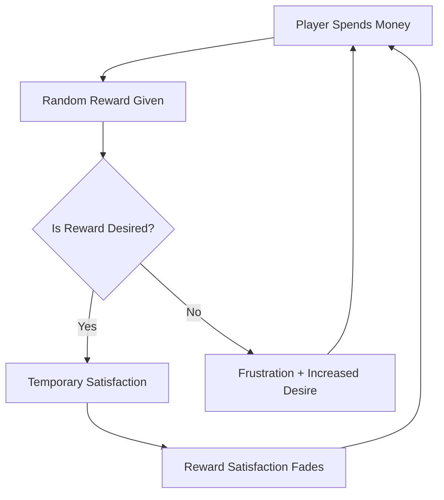

# Immorality of Microtransactions

As someone who has been gaming since the NES era, I've witnessed the industry's evolution from simple cartridge games to today's complex digital ecosystems. While many changes have been positive, the rise of microtransactions represents a troubling shift in how games are designed, marketed, and monetized. What began as an alternative business model has, in many cases, morphed into exploitative systems that raise serious ethical questions.

## The Evolution of Game Monetization

To understand where things went wrong, we need to examine how game monetization has evolved:

| Era | Primary Model | Consumer Experience |
|-----|---------------|---------------------|
| 1980s-1990s | One-time purchase | Complete game at fixed price |
| Early 2000s | Base game + expansions | Substantial content additions at reasonable prices |
| 2010s | Free-to-play with cosmetics | Optional purchases for non-gameplay elements |
| Mid-2010s to Present | Aggressive microtransactions | Psychological manipulation for continuous spending |

This evolution wasn't inherently problematic until the fourth stage, when monetization began to actively harm game design and exploit psychological vulnerabilities.

## The Psychological Manipulation at Play

Modern microtransaction systems employ sophisticated psychological techniques originally developed for gambling:

### 1. Variable Reward Schedules



This cycle, pioneered by psychologist B.F. Skinner, creates a powerful compulsion loop that's particularly effective at driving repeated behaviors. In gaming, it manifests as:

- **Loot boxes**: Random rewards for fixed payment
- **Gacha mechanics**: Collections requiring random draws
- **Resource gambling**: Using premium currency for chance-based rewards

### 2. Artificial Scarcity and FOMO

Many games create a false sense of urgency and scarcity:

- **Limited-time offers**: "Available for 24 hours only!"
- **Exclusive items**: "Never available again!"
- **Battle passes**: "Complete before the season ends!"

This manufactured Fear Of Missing Out (FOMO) drives purchases based on anxiety rather than enjoyment.

### 3. Currency Abstraction

Digital currencies obscure actual spending:

```
Real money ($5.00) → 
  Premium Currency (500 Gems) → 
    Loot Box (250 Gems) → 
      Random Items (Value unclear)
```

These layers of abstraction deliberately distance players from understanding what they're actually spending. Research shows people spend more when using abstract currencies than when using direct cash.

### 4. Artificial Progression Walls

Many games use a technique called "progress gating":

- Design an intentionally frustrating obstacle
- Offer to remove the frustration for a small fee
- Repeat with increasingly expensive solutions

This isn't designing fun that players pay for; it's designing pain that players pay to avoid.

## The Demographics Most Vulnerable

These techniques don't affect all players equally. Research has identified particularly vulnerable demographics:

### 1. Children and Adolescents

Children are especially susceptible for several reasons:

- **Underdeveloped impulse control**: The prefrontal cortex isn't fully developed until ~25
- **Poor understanding of money**: Difficulty grasping the value of digital purchases
- **Social pressure**: Desire to keep up with peers in-game

A 2019 study found that 40% of children didn't understand they were spending real money in games, and 80% couldn't identify the actual cost of their purchases when abstracted through premium currencies.

### 2. People with Addictive Tendencies

The industry term "whales" (players who spend thousands on microtransactions) often masks a darker reality: many are individuals struggling with addiction:

- **10.8%** of microtransaction spending comes from just **0.15%** of players
- Studies show high correlation between problematic gambling and high microtransaction spending
- Former industry insiders have confirmed targeting players showing addictive behaviors

> "I've seen the data and we know who the whales are. We know when they're vulnerable to spending and we absolutely target them during those windows."
> — Anonymous former mobile game product manager

### 3. Players with Completionist Tendencies

People with completionist tendencies or collectors' mentalities are particularly susceptible to:

- **Collection mechanics**: "Collect all 150 characters!"
- **Achievement systems**: "100% the game!"
- **Limited items**: "Complete your collection before it's gone!"

These systems specifically target psychological dispositions that make setting boundaries difficult.

## Case Studies in Exploitation

### 1. Children's Games and Predatory Practices

One particularly troubling example involved a popular children's game that added:

- In-game purchases up to $99.99
- Pop-up promotions during gameplay
- Social pressure mechanics ("Your friend just got this!")
- Deliberately confusing premium currency conversion

The result? Numerous reports of children spending thousands of dollars without parental knowledge. While many platforms now offer refunds in these cases, the psychological manipulation remains deeply problematic.

### 2. The "Skinnerware" Mobile Game

A leading mobile game (which I won't name to avoid promotion) built its entire progression system around exploiting psychological vulnerabilities:

- **Energy systems**: Wait or pay to continue playing
- **Limited-time events**: Creating urgency and FOMO
- **Social competition**: Leaderboards requiring spending to compete
- **Escalating costs**: Early wins followed by exponentially increasing difficulty

Financial disclosures revealed this single game generated over $1 billion annually—primarily from a small percentage of players showing patterns consistent with addiction.

### A Personal Experience with Exploitation

I've experienced the harm of these systems personally. In 2018, I became engrossed in a popular gacha game that employed every psychological trick in the book. What began as "just $5 to support the developers" eventually snowballed:

```
Month 1: $15 spent - "Just to get started"
Month 2: $40 spent - "Special one-time offer"
Month 3: $120 spent - "Limited collaboration event"
Month 4: $250 spent - "Must complete collection"
```

Before I realized it, I had spent over $800 on virtual items with no real-world value. The game hadn't become more fun—I had become more invested in avoiding the pain of missing out and the anxiety of incomplete collections.

This experience opened my eyes to how these systems operate and how easily they can override rational decision-making.

## The Industry's Self-Regulation Failure

The gaming industry has consistently failed to self-regulate effectively:

1. **Refused clear cost disclosures**: Opposing requirements to show actual monetary cost
2. **Fought loot box regulation**: Spending millions lobbying against gambling classifications
3. **Targeted regulatory blind spots**: Shifting to unregulated markets when faced with legislation
4. **Misleading ratings**: Many games with aggressive monetization still receive "E for Everyone" ratings

When Belgium and the Netherlands classified certain loot boxes as gambling, rather than reform practices, many companies simply withdrew from those markets or created country-specific versions.

## The Ethical Framework

Let's examine the ethics of microtransactions through several philosophical lenses:

### Kantian Ethics: The Categorical Imperative

Kant's ethics ask if a practice could be universalized as a rule for everyone. Manipulative microtransactions fail this test because:

- They intentionally obscure information from consumers
- They exploit psychological vulnerabilities rather than offering fair value
- They create artificial problems to sell solutions

### Virtue Ethics: Character and Flourishing

Virtue ethics focuses on practices that promote human flourishing. Exploitative monetization:

- Promotes addictive behavior rather than moderation
- Rewards impulsivity over thoughtful decision-making
- Values short-term gratification over long-term satisfaction

### Utilitarianism: The Greatest Good

Even a utilitarian analysis shows problems:

- The happiness of shareholders and executives comes at the expense of many players
- The long-term psychological harm outweighs short-term pleasure
- Alternative models can provide sustainable revenue without exploitation

## Ethical Alternatives That Work

The problem isn't monetization itself—it's exploitative monetization. Several companies have proven that ethical approaches can still be profitable:

### 1. Transparent Direct Purchases

Games like **Path of Exile** and **Warframe** offer:
- Clear pricing of exactly what you're purchasing
- No randomized rewards for real money
- Cosmetic items that don't affect gameplay
- Reasonable pricing without psychological manipulation

### 2. Fair Expansion Models

Companies like **Nintendo** and studios like **FromSoftware** continue to succeed with:
- Complete base games worth the initial price
- Substantial expansion content at fair prices
- No psychological manipulation tactics

### 3. Ethical Free-to-Play

Some free-to-play games maintain ethical standards:
- Reasonable progression without payment
- Transparent pricing and direct purchases
- No exploitation of FOMO or artificial scarcity
- Clear separation between free and premium experiences

## What Can Be Done?

### As Players

1. **Vote with your wallet**: Support companies with ethical monetization
2. **Recognize manipulation**: Learn to identify psychological tactics
3. **Set spending limits**: Decide on budgets before playing
4. **Talk to children**: Educate young players about these tactics
5. **Request refunds**: When you encounter particularly exploitative practices

### As an Industry

1. **Transparent pricing**: Show actual monetary costs of purchases
2. **Age-appropriate monetization**: Different standards for games marketed to children
3. **Spending limits**: Implement optional caps on monthly spending
4. **Ethical design standards**: Develop and adhere to industry-wide guidelines

### As Regulators

1. **Classify exploitative loot boxes as gambling**
2. **Require clear disclosure** of odds and actual costs
3. **Enforce stricter ratings** for games with microtransactions
4. **Protect vulnerable populations** with spending limits for minors

## Conclusion

The gaming industry stands at an ethical crossroads. One path leads toward increasingly manipulative monetization that treats players as resources to be mined rather than customers to be served. The other path embraces transparent, fair monetization that respects players' agency and builds sustainable businesses based on value rather than exploitation.

As players, developers, and members of the gaming community, we have both the right and responsibility to demand better. The issue isn't whether games should make money—it's how they make that money, and whether those methods respect basic ethical principles.

The most successful games in history became cultural touchstones because they prioritized player experience over short-term profit extraction. By returning to these principles, the industry can build a more sustainable and ethical future that serves both business interests and player wellbeing.

---

*What have your experiences been with microtransactions in games? Have you encountered particularly ethical or unethical examples? Share your thoughts in the comments below.*