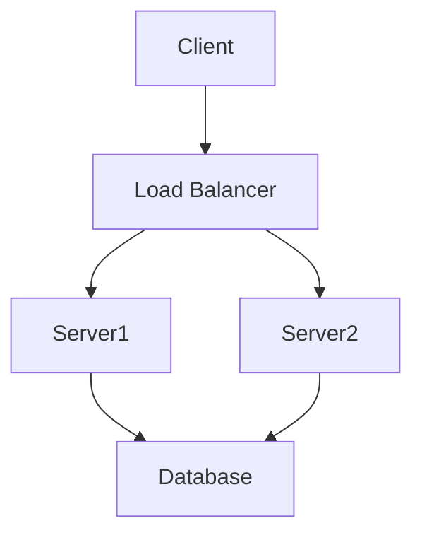

# Advanced Markdown Techniques

After mastering the [basics of Markdown](my-first-post.html), it's time to dive into some advanced techniques that will make your documentation, READMEs, and technical writing stand out. This post explores practical, developer-focused Markdown techniques that go beyond the basics.

## Using Markdown in Development Workflows

As developers, we use Markdown in various contexts. Let's explore how to maximize its effectiveness in different environments.

### Making Your GitHub README Shine

A well-crafted README is essential for any GitHub repository. Here are some tips for creating standout READMEs:

#### Project Badges

Badges provide quick visual indicators about your project's status. They're created using inline images with links:

```markdown
[](https://www.npmjs.com/package/package-name)
[](https://travis-ci.org/username/project)
[](https://coveralls.io/github/username/project?branch=master)
[](LICENSE)
```

These render as clickable badges:

[](https://www.npmjs.com/package/package-name)
[](https://travis-ci.org/username/project)

#### Table of Contents

For longer READMEs, create a table of contents with anchor links:

```markdown
## Table of Contents
- [Installation](#installation)
- [Usage](#usage)
- [API Reference](#api-reference)
- [Contributing](#contributing)
- [License](#license)

## Installation
...

## Usage
...
```

#### Project Logos and Banners

Add visual appeal with a project logo:

```markdown
<p align="center">
  
</p>

<h1 align="center">Project Name</h1>
<p align="center">A concise description of your awesome project</p>
```

### Documentation with Extended Markdown

When writing technical documentation, these features can help organize complex information:

#### Collapsible Sections

GitHub Markdown supports collapsible sections using HTML details tags:

```markdown
<details>
<summary>Click to expand/collapse</summary>

This content is hidden by default but can be expanded.
You can include any Markdown content here.

- Lists
- Code blocks
- etc.

</details>
```

This renders as:

<details>
<summary>Click to expand/collapse</summary>

This content is hidden by default but can be expanded.
You can include any Markdown content here.

- Lists
- Code blocks
- etc.

</details>

#### Advanced Tables

For complex data, you can create more elaborate tables:

```markdown
| Feature | Basic Plan | Pro Plan | Enterprise Plan |
|:--------|:----------:|:--------:|:---------------:|
| Users   | 10         | 100      | Unlimited       |
| Storage | 5GB        | 50GB     | 1TB             |
| Support | Email      | Email, Phone | 24/7 Priority |
| Custom Domain | ❌    | ✅       | ✅              |
| Analytics | Basic    | Advanced | Advanced + Custom |
```

This renders as:

| Feature | Basic Plan | Pro Plan | Enterprise Plan |
|:--------|:----------:|:--------:|:---------------:|
| Users   | 10         | 100      | Unlimited       |
| Storage | 5GB        | 50GB     | 1TB             |
| Support | Email      | Email, Phone | 24/7 Priority |
| Custom Domain | ❌    | ✅       | ✅              |
| Analytics | Basic    | Advanced | Advanced + Custom |

#### Diagrams with Mermaid

Some Markdown environments (including GitHub) support Mermaid diagrams:

````markdown

````

This creates a flowchart diagram describing a system architecture.

## Code Documentation Techniques

As developers, we often need to document code. Here are some effective patterns:

### Documenting Functions

When documenting functions or methods, use this pattern:

```markdown
### `functionName(param1, param2, ...)`

**Parameters:**
- `param1` (Type): Description of param1
- `param2` (Type): Description of param2

**Returns:**
(Return Type): Description of return value

**Example:**
```js
const result = functionName('example', 123);
console.log(result); // Expected output
```

**Notes:**
Any additional information about edge cases, errors, or considerations.
```

### API Endpoint Documentation

For REST APIs:

```markdown
## `GET /api/users`

Retrieves a list of users.

**Query Parameters:**
- `limit` (number, optional): Maximum number of users to return. Default: 20
- `offset` (number, optional): Number of users to skip. Default: 0

**Response:**
```json
{
  "total": 100,
  "users": [
    {
      "id": 1,
      "name": "John Doe",
      "email": "john@example.com"
    },
    // ...
  ]
}
```

**Status Codes:**
- `200 OK`: Successfully retrieved users
- `400 Bad Request`: Invalid parameters
- `401 Unauthorized`: Authentication required
```

## Tips for Technical Blog Posts

When writing technical blog posts (like this one!), these techniques can enhance readability:

### Callouts and Notes

Create attention-grabbing callouts:

```markdown
> **Note**: This is important information that readers should pay attention to.

> **Warning**: Be careful about this potential pitfall.

> **Tip**: Here's a helpful shortcut to make your life easier.
```

This renders as:

> **Note**: This is important information that readers should pay attention to.

> **Warning**: Be careful about this potential pitfall.

> **Tip**: Here's a helpful shortcut to make your life easier.

### Step-by-Step Instructions

For tutorials, number your steps clearly:

```markdown
## Getting Started

1. **Install the package**
   
   ```bash
   npm install my-package
   ```

2. **Configure your settings**
   
   Create a `config.js` file with the following:
   
   ```js
   module.exports = {
     apiKey: 'YOUR_API_KEY',
     endpoint: 'https://api.example.com'
   };
   ```

3. **Initialize in your application**
   
   ```js
   const myPackage = require('my-package');
   const config = require('./config');
   
   myPackage.init(config);
   ```
```

### Keyboard Shortcuts

Display keyboard shortcuts using the `<kbd>` HTML tag:

```markdown
Press <kbd>Ctrl</kbd> + <kbd>C</kbd> to copy text.
```

This renders as: Press <kbd>Ctrl</kbd> + <kbd>C</kbd> to copy text.

## Markdown for Project Management

Developers often use Markdown for project management in issues and pull requests:

### Well-Structured Bug Reports

Template for bug reports:

```markdown
## Bug Description
Briefly describe the bug

## Steps to Reproduce
1. Go to '...'
2. Click on '....'
3. Scroll down to '....'
4. See error

## Expected Behavior
A clear description of what you expected to happen.

## Actual Behavior
A clear description of what actually happened.

## Screenshots
If applicable, add screenshots to help explain the problem.

## Environment
- OS: [e.g. Windows 10]
- Browser: [e.g. Chrome 91]
- Version: [e.g. v1.2.3]

## Additional Context
Add any other context about the problem here.
```

### Feature Request Template

Structure feature requests like this:

```markdown
## Problem Statement
A clear description of what the problem is. Ex. I'm always frustrated when [...]

## Proposed Solution
A clear description of what you want to happen.

## Alternative Solutions
A clear description of any alternative solutions or features you've considered.

## Additional Context
Add any other context or screenshots about the feature request here.
```

## Markdown in Different Environments

Markdown renders differently depending on where it's used. Here's how to adapt to different platforms:

### GitHub Flavored Markdown (GFM)

GitHub supports specific extensions like:

- Task lists: `- [x]` and `- [ ]`
- Auto-linking references to issues and pull requests: `#123`
- Strikethrough: `~~text~~`
- Tables with pipe syntax
- Emoji shortcodes: `:smile:`

### Notion

Notion supports most standard Markdown but has its own extensions:

- Toggle lists with `>`
- Callout blocks with `>`
- Equation blocks with `$$`

### Discord

Discord uses a simplified Markdown:

- Basic formatting (bold, italic, strikethrough)
- Code blocks (single and triple backticks)
- Block quotes with `>`
- No support for images or tables through Markdown

## Advanced Formatting Tricks

### Text Alignment

Some Markdown renderers support HTML for text alignment:

```markdown
<div align="center">
  <h1>Centered Heading</h1>
  <p>This paragraph is also centered.</p>
</div>

<p align="right">Right-aligned text</p>
```

### Custom Styling

In environments that support HTML and CSS (like GitHub README files):

```markdown
<div style="background-color: #f0f0f0; padding: 15px; border-radius: 5px;">
  <h3 style="color: #333;">Custom Styled Section</h3>
  <p>This section has custom styling applied.</p>
</div>
```

### Embedding Content

Embed videos, tweets, or other content using HTML:

```markdown
<iframe width="560" height="315" src="https://www.youtube.com/embed/YOUTUBE_VIDEO_ID" frameborder="0" allowfullscreen></iframe>
```

## Markdown Tools for Developers

To enhance your Markdown workflow, consider these tools:

### Markdown Linters

Ensure consistent style with linters:

- **markdownlint**: Checks for style and syntax issues
- **Prettier**: Auto-formats Markdown files

Add to your CI pipeline:

```bash
# Install markdownlint
npm install -g markdownlint-cli

# Run checks
markdownlint *.md
```

### Markdown Editors with Preview

Use editors with live preview:

- **VS Code** with Markdown extensions
- **Typora**
- **StackEdit**
- **Dillinger**

### Convert Markdown to Other Formats

Use **Pandoc** to convert Markdown to various formats:

```bash
# Install Pandoc
apt-get install pandoc

# Convert Markdown to HTML
pandoc file.md -o file.html

# Convert Markdown to PDF
pandoc file.md -o file.pdf

# Convert Markdown to DOCX
pandoc file.md -o file.docx
```

## Best Practices for Developer Documentation

When documenting code and projects:

1. **Keep headings hierarchical**: Follow a logical structure
2. **Use code blocks liberally**: Always specify the language for syntax highlighting
3. **Provide examples**: Show usage examples for all functions and features
4. **Be consistent**: Use the same patterns throughout your documentation
5. **Update regularly**: Keep documentation in sync with code

## Common Markdown Anti-Patterns to Avoid

Avoid these common mistakes:

1. **Overusing emphasis**: Too much *italic* and **bold** text reduces impact
2. **Inconsistent heading levels**: Don't skip levels (h1 → h3)
3. **Long paragraphs**: Break text into readable chunks
4. **Ambiguous links**: Use descriptive link text instead of "click here"
5. **Ignoring white space**: Use blank lines to separate elements for readability

## Conclusion

Markdown is much more than a simple formatting language - it's a powerful tool for developers to create beautiful, functional documentation. By mastering these advanced techniques, you can create more effective documentation, READMEs, and technical content that stands out and serves its readers well.

I hope this guide helps you take your Markdown skills to the next level!

---

*What advanced Markdown techniques do you use in your development workflow? Share in the comments below!*